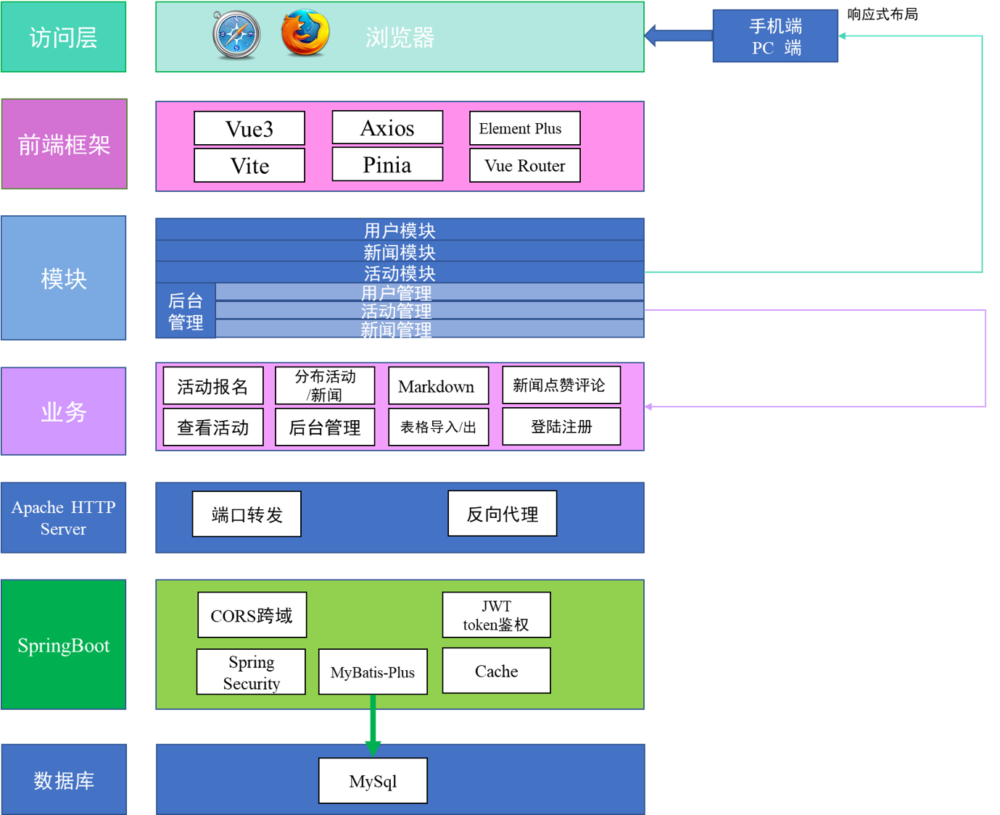
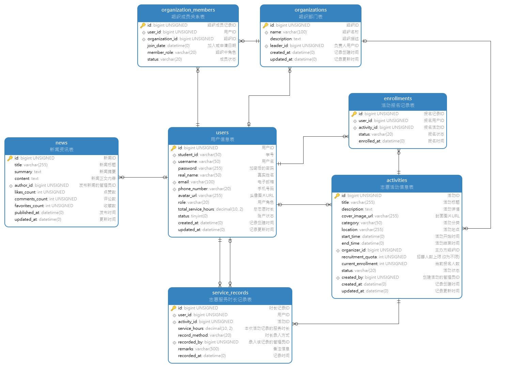
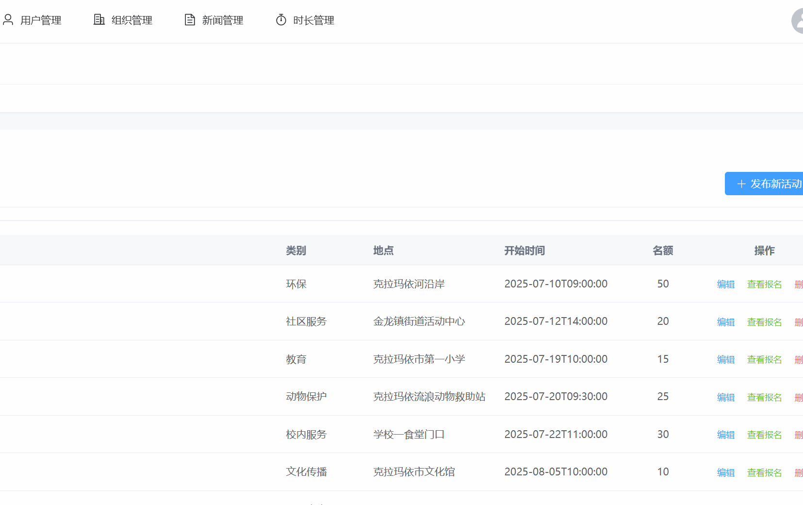
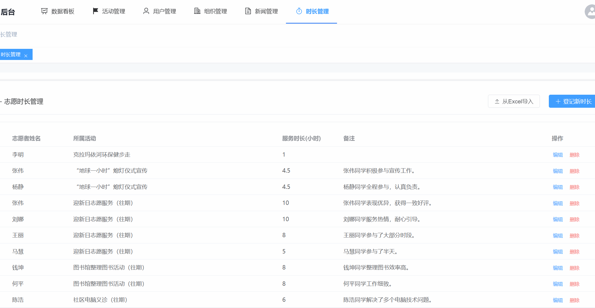

<Catalog />

# 志愿服务平台

## 项目许可
 [![CC BY-NC-SA 4.0][cc-by-nc-sa-shield]][cc-by-nc-sa]

本作品根据[署名—非商业性使用—相同方式共享 4.0 协议][cc-by-nc-sa]进行许可。

[![CC BY-NC-SA 4.0][cc-by-nc-sa-image]][cc-by-nc-sa]

[cc-by-nc-sa]: http://creativecommons.org/licenses/by-nc-sa/4.0/
[cc-by-nc-sa-image]: https://licensebuttons.net/l/by-nc-sa/4.0/88x31.png
[cc-by-nc-sa-shield]: https://img.shields.io/badge/License-CC%20BY--NC--SA%204.0-lightgrey.svg

## 项目描述

### 项目选题

油炬智愿 —— 中国石油大学（北京）克拉玛依校区志愿服务平台

### 技术栈

- 后端：Java SpringBoot, Spring MVC, Spring Security, Mybatis-Plus,JWT
- 构建工具：Maven（后端）,Vite（前端）
- 前端： Vue3、Pinia、Vue Router、Axios、Element Plus
- 数据库：MySQL
- 版本管理：Git
- 代码托管：GitHub
- 服务器：Docker

### 开发环境

- 后端开发环境: JDK 21 (LTS)
- 前端开发环境: Node.js 22 (LTS)
- 容器化环境: Docker Desktop 

### 技术架构

### 数据库设计

## 功能展示

#### 用户端

首页通过结构化的信息布局和视觉元素，向所有访问者（包括潜在志愿者、活动组织者及普通访客）传递平台的核心价值、功能概览与最新动态，并作为核心流量分发枢纽，引导用户至平台内各功能模块。

前台主要功能展示：新闻、报名

---

#### 管理端

各项管理展示

活动信息导出功能

志愿时长导入功能

