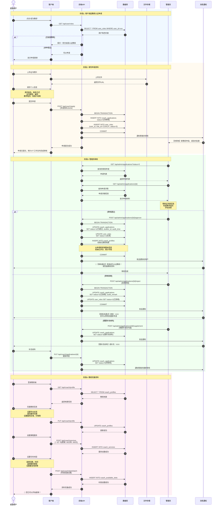
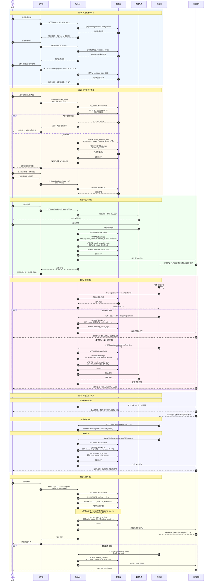
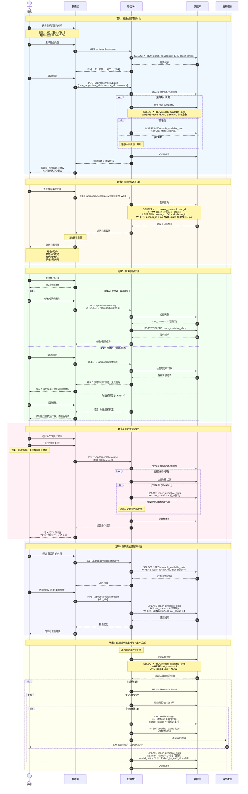
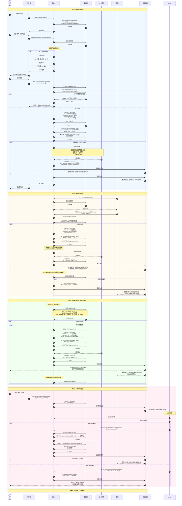
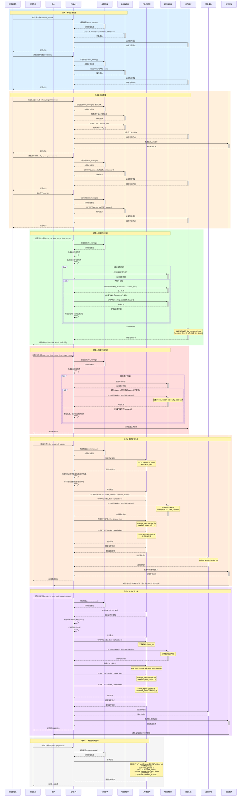

```mermaid
sequenceDiagram
    autonumber
    
    actor User as 普通用户
    participant App as 客户端
    participant API as 后端API
    participant DB as 数据库
    participant OSS as 文件存储
    participant Admin as 管理员
    participant Msg as 消息通知
    
    rect rgb(240, 248, 255)
        Note over User,Admin: 阶段1: 用户发起教练认证申请
        User->>App: 点击"成为教练"
        App->>API: GET /api/user/roles
        API->>DB: SELECT * FROM user_roles WHERE user_id=xxx
        DB-->>API: 用户角色列表
        
        alt 已经是教练
            API-->>App: 提示：您已经是认证教练
        else 未申请过
            API-->>App: 可以申请
            App-->>User: 显示申请表单
        end
    end
    
    rect rgb(255, 250, 240)
        Note over User,Admin: 阶段2: 填写申请资料
        User->>App: 上传证书照片
        App->>OSS: 上传文件
        OSS-->>App: 返回文件URL
        
        User->>App: 填写个人信息
        Note over User,App: 真实姓名、联系方式<br/>证书类型、编号<br/>教学经历、自我介绍等
        
        User->>App: 提交申请
        App->>API: POST /api/coach/apply<br/>{申请资料JSON}
        
        API->>DB: BEGIN TRANSACTION
        
        API->>DB: INSERT INTO coach_applications<br/>status=0(待审核)
        
        API->>DB: INSERT INTO user_roles<br/>(user_id, role_id='COACH', status=0)
        
        API->>DB: COMMIT
        
        API->>Msg: 通知管理员审核
        Msg-->>Admin: 【待审核】新教练申请，请及时处理
        
        API-->>App: 申请提交成功
        App-->>User: 申请已提交，预计3个工作日内完成审核
    end
    
    rect rgb(240, 255, 240)
        Note over User,Admin: 阶段3: 管理员审核
        Admin->>API: GET /api/admin/applications?status=0
        API->>DB: 查询待审核申请
        DB-->>API: 申请列表
        API-->>Admin: 返回申请列表
        
        Admin->>API: GET /api/admin/applications/{id}
        API->>DB: 查询申请详情
        DB-->>API: 申请详细信息
        API-->>Admin: 显示申请材料
        
        Note over Admin: 审核证书真实性<br/>检查教学经历<br/>评估资质
        
        alt 审核通过
            Admin->>API: POST /api/admin/applications/{id}/approve
            
            API->>DB: BEGIN TRANSACTION
            
            API->>DB: UPDATE coach_applications<br/>SET status=1(已通过), auditor_id, audit_time
            
            API->>DB: UPDATE user_roles<br/>SET status=1(生效)
            
            API->>DB: INSERT INTO coach_profiles<br/>初始化教练档案
            Note over API,DB: 从申请表复制基本信息<br/>初始化评分、统计字段
            
            API->>DB: COMMIT
            
            API->>Msg: 发送通知给用户
            Msg-->>User: 🎉【审核通过】恭喜成为认证教练！<br/>请完善教练资料
            
            API-->>Admin: 审核完成
            
        else 审核拒绝
            Admin->>API: POST /api/admin/applications/{id}/reject<br/>{拒绝原因}
            
            API->>DB: BEGIN TRANSACTION
            API->>DB: UPDATE coach_applications<br/>SET status=2(已拒绝), audit_remark
            API->>DB: UPDATE user_roles SET status=2(已拒绝)
            API->>DB: COMMIT
            
            API->>Msg: 发送通知
            Msg-->>User: 【审核未通过】原因：XXX<br/>您可以修改后重新申请
            
        else 需要补充材料
            Admin->>API: POST /api/admin/applications/{id}/supplement<br/>{需要补充的内容}
            
            API->>DB: UPDATE coach_applications<br/>SET status=3(需补充材料)
            
            API->>Msg: 发送通知
            Msg-->>User: 【需补充材料】请补充：XXX
            
            User->>App: 补充材料
            App->>API: PUT /api/coach/applications/{id}<br/>更新申请
            API->>DB: UPDATE coach_applications<br/>SET status=0(待审核)
            API->>Msg: 通知管理员重新审核
        end
    end
    
    rect rgb(255, 240, 245)
        Note over User,Admin: 阶段4: 教练完善资料
        User->>App: 登录教练端
        App->>API: GET /api/coach/profile
        API->>DB: SELECT * FROM coach_profiles
        DB-->>API: 教练档案
        API-->>App: 返回档案信息
        
        User->>App: 完善教练信息
        Note over User,App: 设置专长标签<br/>填写教学风格<br/>设置服务区域、价格等
        
        App->>API: PUT /api/coach/profile
        API->>DB: UPDATE coach_profiles
        DB-->>API: 更新成功
        
        User->>App: 创建课程服务
        App->>API: POST /api/coach/services<br/>{一对一私教课, 90分钟, 300元}
        API->>DB: INSERT INTO coach_services
        DB-->>API: 服务创建成功
        
        User->>App: 设置可约时段
        Note over User,App: 选择日期、时间<br/>选择服务类型<br/>设置重复规则等
        
        App->>API: POST /api/coach/slots/batch<br/>{时段批量设置}
        API->>DB: INSERT INTO coach_available_slots
        DB-->>API: 时段创建成功
        
        API-->>App: 资料完善成功
        App-->>User: 🎉 您已可以开始接单！
    end
```

```mermaid
sequenceDiagram
    autonumber
    
    actor User as 用户
    participant App as 客户端
    participant API as 后端API
    participant DB as 数据库
    participant Pay as 支付系统
    participant Coach as 教练端
    participant Msg as 消息通知
    
    rect rgb(240, 248, 255)
        Note over User,Coach: 阶段1: 浏览教练和时段
        User->>App: 浏览教练列表
        App->>API: GET /api/coaches?region=xxx
        API->>DB: 查询 coach_profiles + user_profiles
        DB-->>API: 返回教练列表
        API-->>App: 教练数据（含评分、价格区间）
        
        User->>App: 查看教练详情
        App->>API: GET /api/coaches/{id}
        API->>DB: 查询教练信息 + coach_services
        DB-->>API: 教练详情 + 服务列表
        API-->>App: 返回详细信息
        
        User->>App: 选择日期查看可约时段
        App->>API: GET /api/coaches/{id}/slots?date=2024-12-10
        API->>DB: 查询 v_available_slots 视图
        DB-->>API: 可预约时段列表
        API-->>App: 时段列表（含服务类型、价格）
    end
    
    rect rgb(255, 250, 240)
        Note over User,Coach: 阶段2: 锁定时段并下单
        User->>App: 选择时段和服务类型
        App->>API: POST /api/bookings/lock<br/>{slot_id, service_id}
        
        API->>DB: BEGIN TRANSACTION
        API->>DB: SELECT ... FOR UPDATE<br/>检查时段状态
        
        alt 时段已被占用
            DB-->>API: slot_status != 1
            API-->>App: 提示：时段已被预订
            App-->>User: 显示错误，刷新时段列表
        else 时段可用
            API->>DB: UPDATE coach_available_slots<br/>SET status=3, locked_until=NOW()+15分钟
            API->>DB: INSERT INTO bookings<br/>status=1(待支付)
            DB-->>API: 订单创建成功
            API->>DB: COMMIT
            API-->>App: 返回订单号 + 过期时间
            App-->>User: 跳转填写信息页面
        end
        
        User->>App: 填写联系信息、特殊需求
        User->>App: 选择优惠券（可选）
        App->>API: PUT /api/bookings/{order_no}<br/>更新订单信息
        API->>DB: UPDATE bookings
        DB-->>API: 更新成功
    end
    
    rect rgb(240, 255, 240)
        Note over User,Coach: 阶段3: 支付流程
        User->>App: 点击支付
        App->>API: POST /api/bookings/{order_no}/pay
        API->>Pay: 调起支付（微信/支付宝）
        Pay-->>User: 显示支付页面
        
        User->>Pay: 完成支付
        Pay->>API: 支付回调通知
        
        API->>DB: BEGIN TRANSACTION
        API->>DB: UPDATE bookings<br/>SET payment_status=1, booking_status=2(待确认)
        API->>DB: UPDATE coach_available_slots<br/>SET slot_status=2(已预订)
        API->>DB: INSERT booking_status_logs
        API->>DB: COMMIT
        
        API->>Msg: 发送通知给教练
        Msg-->>Coach: 【新预约】用户XXX预约了您12/10的课程
        API-->>App: 支付成功
        App-->>User: 显示预约成功，等待教练确认
    end
    
    rect rgb(255, 240, 245)
        Note over User,Coach: 阶段4: 教练确认
        Coach->>Coach: 查看预约通知
        Coach->>API: GET /api/coach/bookings?status=2
        API->>DB: 查询待确认订单
        DB-->>API: 订单列表
        API-->>Coach: 返回待确认订单
        
        alt 教练确认接单
            Coach->>API: POST /api/coach/bookings/{id}/confirm
            API->>DB: UPDATE bookings<br/>SET status=3(已确认), confirmed_by=1
            API->>DB: INSERT booking_status_logs
            API->>Msg: 发送通知给用户
            Msg-->>User: 【预约确认】教练已确认，请准时上课
        else 教练拒绝（如时间冲突）
            Coach->>API: POST /api/coach/bookings/{id}/reject<br/>{reason}
            API->>DB: BEGIN TRANSACTION
            API->>DB: UPDATE bookings<br/>SET status=6(已取消), cancel_reason
            API->>DB: UPDATE coach_available_slots<br/>SET slot_status=1(恢复可预约)
            API->>DB: COMMIT
            API->>Pay: 发起退款
            Pay-->>API: 退款成功
            API->>Msg: 发送退款通知
            Msg-->>User: 【预约取消】教练无法接单，已退款
        end
    end
    
    rect rgb(245, 245, 255)
        Note over User,Coach: 阶段5: 课程进行与完成
        Note over User,Coach: 课程开始前1小时
        API->>Msg: 定时任务：发送上课提醒
        Msg-->>User: 【上课提醒】您的课程将在1小时后开始
        Msg-->>Coach: 【上课提醒】您有一节课程即将开始
        
        Note over User,Coach: 课程时间到达
        Coach->>API: POST /api/coach/bookings/{id}/start
        API->>DB: UPDATE bookings SET status=4(进行中)
        
        Note over User,Coach: 课程结束
        Coach->>API: POST /api/coach/bookings/{id}/complete
        API->>DB: BEGIN TRANSACTION
        API->>DB: UPDATE bookings<br/>SET status=5(已完成), completed_at=NOW()
        API->>DB: UPDATE coach_profiles<br/>累加 total_hours, total_courses
        API->>DB: COMMIT
        
        API->>Msg: 发送评价邀请
        Msg-->>User: 【课程结束】快来评价您的教练吧
    end
    
    rect rgb(255, 255, 240)
        Note over User,Coach: 阶段6: 用户评价
        User->>App: 提交评价
        App->>API: POST /api/bookings/{id}/review<br/>{rating, content, tags}
        
        API->>DB: BEGIN TRANSACTION
        API->>DB: INSERT INTO booking_reviews
        API->>DB: UPDATE bookings SET is_reviewed=1
        
        API->>DB: 计算教练新评分
        Note over API,DB: AVG(overall_rating) FROM booking_reviews<br/>WHERE coach_id = xxx
        
        API->>DB: UPDATE coach_profiles<br/>SET rating_score=新分数, rating_count+=1
        API->>DB: COMMIT
        
        API->>Msg: 通知教练有新评价
        Msg-->>Coach: 【新评价】用户对您的课程评价了5星
        
        API-->>App: 评价成功
        App-->>User: 感谢您的评价！
        
        opt 教练回复评价
            Coach->>API: POST /api/reviews/{id}/reply<br/>{reply_content}
            API->>DB: UPDATE booking_reviews<br/>SET coach_reply, coach_reply_time
            API->>Msg: 通知用户教练已回复
            Msg-->>User: 教练回复了您的评价
        end
    end
```

```mermaid
sequenceDiagram
    autonumber
    
    actor Coach as 教练
    participant App as 教练端
    participant API as 后端API
    participant DB as 数据库
    participant Msg as 消息通知
    
    rect rgb(240, 248, 255)
        Note over Coach,Msg: 场景1: 批量创建可约时段
        Coach->>App: 选择日期范围和时间
        Note over Coach,App: 例如：12月10日-12月31日<br/>每周一三五 18:00-20:00
        
        Coach->>App: 选择服务类型
        App->>API: GET /api/coach/services
        API->>DB: SELECT * FROM coach_services WHERE coach_id=xxx
        DB-->>API: 服务列表
        API-->>App: 返回[一对一私教, 一对二, 小班课]
        
        Coach->>App: 确认创建
        App->>API: POST /api/coach/slots/batch<br/>{date_range, time_slots, service_id, recurrence}
        
        API->>DB: BEGIN TRANSACTION
        
        loop 遍历每个日期
            API->>DB: 检查是否有冲突时段
            Note over API,DB: SELECT * FROM coach_available_slots<br/>WHERE coach_id AND date AND time重叠
            
            alt 无冲突
                API->>DB: INSERT INTO coach_available_slots<br/>多条记录（根据日期范围）
            else 有冲突
                Note over API: 记录冲突日期，跳过
            end
        end
        
        API->>DB: COMMIT
        API-->>App: 创建成功 + 冲突提示
        App-->>Coach: 显示：已创建XX个时段<br/>X个日期因冲突跳过
    end
    
    rect rgb(255, 250, 240)
        Note over Coach,Msg: 场景2: 查看时段和订单
        Coach->>App: 查看本周课程安排
        App->>API: GET /api/coach/schedule?week=2024-W50
        
        API->>DB: 复杂查询
        Note over API,DB: SELECT s.*, b.booking_status, b.user_id<br/>FROM coach_available_slots s<br/>LEFT JOIN bookings b ON s.id = b.slot_id<br/>WHERE s.coach_id = xxx AND s.date BETWEEN xxx
        
        DB-->>API: 时段 + 订单信息
        API-->>App: 返回日历数据
        
        Note over App: 渲染课程日历
        App-->>Coach: 显示日历视图
        Note over Coach,App: 绿色=可约<br/>黄色=已锁定<br/>红色=已预订<br/>灰色=已关闭
    end
    
    rect rgb(240, 255, 240)
        Note over Coach,Msg: 场景3: 修改/删除时段
        Coach->>App: 选择某个时段
        App-->>Coach: 显示时段详情
        
        alt 时段未被预订 (status=1)
            Coach->>App: 修改时间或删除
            App->>API: PUT /api/coach/slots/{id}<br/>OR DELETE /api/coach/slots/{id}
            
            API->>DB: 检查状态
            DB-->>API: slot_status = 1 (可操作)
            
            API->>DB: UPDATE/DELETE coach_available_slots
            DB-->>API: 操作成功
            API-->>App: 修改/删除成功
            
        else 时段已被预订 (status=2)
            Coach->>App: 尝试删除
            App->>API: DELETE /api/coach/slots/{id}
            
            API->>DB: 检查是否有订单
            DB-->>API: 存在关联订单
            
            API-->>App: 错误：该时段已有预订，无法删除
            App-->>Coach: 提示：请先取消订单后再删除时段
            
        else 时段被锁定 (status=3)
            Coach->>App: 尝试修改
            API-->>App: 错误：时段已被锁定
            App-->>Coach: 该时段正在被预订中，请稍后再试
        end
    end
    
    rect rgb(255, 240, 245)
        Note over Coach,Msg: 场景4: 临时关闭时段
        Coach->>App: 选择多个未预订时段
        Coach->>App: 点击"批量关闭"
        Note over Coach: 例如：临时有事，关闭本周所有时段
        
        App->>API: POST /api/coach/slots/close<br/>{slot_ids: [1,2,3...]}
        
        API->>DB: BEGIN TRANSACTION
        
        loop 遍历每个时段
            API->>DB: 检查时段状态
            
            alt 时段可用 (status=1)
                API->>DB: UPDATE coach_available_slots<br/>SET slot_status = 4 (教练关闭)
            else 时段已预订 (status=2)
                Note over API: 跳过，记录到失败列表
            end
        end
        
        API->>DB: COMMIT
        
        API-->>App: 返回操作结果
        App-->>Coach: 已关闭XX个时段<br/>X个时段已有预订，无法关闭
    end
    
    rect rgb(245, 245, 255)
        Note over Coach,Msg: 场景5: 重新开放已关闭时段
        Coach->>App: 筛选"已关闭"的时段
        App->>API: GET /api/coach/slots?status=4
        API->>DB: SELECT * FROM coach_available_slots<br/>WHERE coach_id=xxx AND slot_status=4
        DB-->>API: 已关闭时段列表
        API-->>App: 返回列表
        
        Coach->>App: 选择时段，点击"重新开放"
        App->>API: POST /api/coach/slots/reopen<br/>{slot_ids}
        
        API->>DB: UPDATE coach_available_slots<br/>SET slot_status = 1 (可预约)<br/>WHERE id IN (xxx) AND slot_status = 4
        
        DB-->>API: 更新成功
        API-->>App: 操作成功
        App-->>Coach: 时段已重新开放
    end
    
    rect rgb(255, 255, 240)
        Note over Coach,Msg: 场景6: 处理过期锁定时段（定时任务）
        Note over API: 定时任务每分钟执行
        
        API->>DB: 查询过期锁定
        Note over API,DB: SELECT * FROM coach_available_slots<br/>WHERE slot_status = 3<br/>AND locked_until < NOW()
        
        DB-->>API: 返回过期锁定的时段
        
        alt 有过期时段
            API->>DB: BEGIN TRANSACTION
            
            loop 每个过期时段
                API->>DB: 检查是否有对应订单
                
                alt 有待支付订单
                    API->>DB: UPDATE bookings<br/>SET status = 6 (已取消)<br/>cancel_reason = '超时未支付'
                    
                    API->>DB: INSERT booking_status_logs<br/>记录系统取消
                    
                    API->>Msg: 发送取消通知
                    Msg-->>Coach: 订单已自动取消（超时未支付）
                end
                
                API->>DB: UPDATE coach_available_slots<br/>SET slot_status = 1 (恢复可预约)<br/>locked_until = NULL, locked_by_user_id = NULL
            end
            
            API->>DB: COMMIT
        end
    end
```

```mermaid
sequenceDiagram
    autonumber
    
    actor User as 用户
    participant App as 客户端
    participant API as 后端API
    participant DB as 数据库
    participant Pay as 支付系统
    participant Coach as 教练
    participant Msg as 消息通知
    
    rect rgb(240, 248, 255)
        Note over User,Msg: 场景1: 用户取消订单
        User->>App: 查看我的预约
        App->>API: GET /api/bookings/my
        API->>DB: SELECT * FROM bookings<br/>WHERE user_id = xxx<br/>ORDER BY booking_date DESC
        DB-->>API: 订单列表
        API-->>App: 返回订单
        
        User->>App: 选择订单，点击取消
        App->>API: GET /api/bookings/{id}/cancel-policy
        
        API->>DB: 查询订单详情
        DB-->>API: 订单信息
        
        Note over API: 计算距离上课时间
        alt 距上课 > 24小时
            API-->>App: 可全额退款
        else 24小时 > 距上课 > 1小时
            API-->>App: 可退款50%
        else 距上课 < 1小时
            API-->>App: 不可退款
        end
        
        App-->>User: 显示取消政策和退款金额
        
        User->>App: 确认取消
        App->>API: POST /api/bookings/{id}/cancel<br/>{cancel_reason}
        
        API->>DB: BEGIN TRANSACTION
        
        API->>DB: SELECT * FROM bookings<br/>WHERE id = xxx FOR UPDATE
        
        alt 订单状态不允许取消
            DB-->>API: status IN (已完成, 已取消)
            API->>DB: ROLLBACK
            API-->>App: 错误：订单状态XXX不允许取消
        else 可以取消
            API->>DB: UPDATE bookings<br/>SET status =  (已取消)<br/>cancelled_by =  (用户取消)<br/>cancel_reason = xxx<br/>cancelled_at = NOW()
            
            API->>DB: 检查关联时段
            DB-->>API: slot_id = xxx
            
            API->>DB: UPDATE coach_available_slots<br/>SET slot_status = 1 (恢复可预约)<br/>WHERE id = slot_id
            
            API->>DB: INSERT INTO booking_status_logs<br/>记录取消操作
            
            API->>DB: COMMIT
            
            alt 需要退款 (已支付订单)
                API->>Pay: 调用退款接口
                Note over API,Pay: 根据取消政策计算退款金额<br/>- 提前24小时：100%<br/>- 提前1-24小时：50%<br/>- 1小时内：0%
                
                Pay-->>API: 退款成功
                
                API->>DB: UPDATE bookings<br/>SET payment_status = 3 (全额退款)<br/>或 payment_status = 2 (部分退款)
                
                API->>Msg: 发送退款通知
                Msg-->>User: 【退款通知】已退款XX元至原支付账户
            end
            
            API->>Msg: 通知教练
            Msg-->>Coach: 【订单取消】用户取消了12/10的预约
            
            API-->>App: 取消成功
            App-->>User: 订单已取消
        end
    end
    
    rect rgb(255, 250, 240)
        Note over User,Msg: 场景2: 教练取消订单
        
        Coach->>API: GET /api/coach/bookings
        API->>DB: 查询教练订单
        DB-->>API: 订单列表
        API-->>Coach: 返回订单
        
        Coach->>API: POST /api/coach/bookings/{id}/cancel<br/>{cancel_reason}
        
        API->>DB: BEGIN TRANSACTION
        
        API->>DB: SELECT * FROM bookings<br/>WHERE id = xxx FOR UPDATE
        
        alt 订单可取消
            API->>DB: UPDATE bookings<br/>SET status = (已取消)<br/>cancelled_by = (教练取消)<br/>cancel_reason = xxx
            
            API->>DB: UPDATE coach_available_slots<br/>SET slot_status = 1 (恢复)
            
            API->>DB: INSERT booking_status_logs
            
            API->>DB: COMMIT
            
            Note over API: 教练取消，无论何时都全额退款
            API->>Pay: 发起全额退款
            Pay-->>API: 退款成功
            
            API->>DB: UPDATE bookings<br/>SET payment_status = 3
            
            API->>Msg: 发送通知
            Msg-->>User: 【订单取消】教练因XXX原因无法授课<br/>已全额退款，给您带来不便敬请谅解
            
            Note over API: 记录教练取消次数（影响展示排序权重）
            API->>DB: 增加教练取消计数
            
            alt 教练频繁取消
                API->>DB: UPDATE coach_profiles<br/>SET coach_status = 2 (休假中)
                API->>Msg: 警告教练
                Msg-->>Coach: 【警告】您本月已取消3次订单<br/>已自动暂停接单，请联系客服
            end
            
        end
    end
    
    rect rgb(240, 255, 240)
        Note over User,Msg: 场景3: 系统自动取消（超时未确认）
        Note over API: 定时任务：每小时检查
        
        API->>DB: 查询超时未确认订单
        Note over API,DB: SELECT * FROM bookings<br/>WHERE status = 2 (待确认)<br/>AND created_at < NOW() - INTERVAL 24 HOUR
        
        DB-->>API: 返回超时订单
        
        alt 有超时订单
            loop 每个超时订单
                API->>DB: BEGIN TRANSACTION
                
                API->>DB: UPDATE bookings<br/>SET status = 6 (已取消)<br/>cancelled_by = 3 (系统取消)<br/>cancel_reason = '教练超时未确认'
                
                API->>DB: UPDATE coach_available_slots<br/>SET slot_status = 1
                
                API->>DB: INSERT booking_status_logs
                
                API->>Pay: 全额退款
                Pay-->>API: 退款成功
                
                API->>DB: UPDATE bookings<br/>SET payment_status = 3
                
                API->>DB: COMMIT
                
                API->>Msg: 发送通知
                Msg-->>User: 【订单取消】教练24小时未确认<br/>已自动取消并全额退款
                Msg-->>Coach: 【系统通知】订单因超时未确认已被取消<br/>请及时处理预约
                
                Note over API: 记录教练超时（影响排序权重）
                API->>DB: 记录教练服务质量问题
            end
        end
    end
    
    rect rgb(255, 240, 245)
        Note over User,Msg: 场景4: 订单纠纷处理
        User->>App: 申诉：教练未到场
        App->>API: POST /api/bookings/{id}/dispute<br/>{type: "coach_absent"}
                
        API->>DB: UPDATE bookings<br/>SET has_dispute = 1
        
        API->>Msg: 通知客服处理
        Msg-->>Admin: 【订单纠纷】用户投诉教练未到场
        
        Note over Admin: 人工审核
        Admin->>API: 查看纠纷详情
        Admin->>Coach: 联系教练核实
        
        alt 确认教练责任
            Admin->>API: POST /api/admin/disputes/{id}/resolve<br/>{result: "refund_full"}
            
            API->>DB: BEGIN TRANSACTION
            API->>DB: UPDATE booking_disputes SET status = 1 (已解决)
            API->>Pay: 全额退款
            API->>DB: UPDATE bookings SET payment_status = 3
            
            API->>DB: UPDATE coach_profiles<br/>处罚教练
            API->>DB: COMMIT
            
            API->>Msg: 发送处理结果
            Msg-->>User: 纠纷已解决，已退款
            Msg-->>Coach: 因服务问题，订单已退款并处罚教练
            
        else 确认用户误解
            Admin->>API: POST /api/admin/disputes/{id}/resolve<br/>{result: "reject", reason: "..."}
            
            API->>DB: UPDATE booking_disputes<br/>SET status = 2 (已拒绝)
            
            API->>Msg: 解释说明
            Msg-->>User: 经核实，教练已按时到场<br/>如有疑问请联系客服
        end
    end
    
    rect rgb(245, 245, 255)
        Note over User,Msg: 场景5: 改约流程（可选功能）
    end
```

```mermaid
sequenceDiagram
    participant Admin as 场馆管理员
    participant Staff as 场馆员工
    participant Customer as 客户
    participant API as 后端API
    participant Auth as 权限模块
    participant VenueDB as 场馆数据库
    participant OrderDB as 订单数据库
    participant SlotDB as 时段数据库
    participant Log as 日志系统
    participant Refund as 退款模块
    participant Notify as 通知模块

    %% ========== 场景1: 场地信息设置 ==========
    rect rgb(220, 240, 255)
        Note over Admin,VenueDB: 场景1: 场地信息设置
        Admin->>+API: 修改场馆信息(venue_id, data)
        API->>+Auth: 校验权限(venue_setting)
        Auth-->>-API: 权限验证通过
        API->>+VenueDB: UPDATE venues SET name=?, address=?
        VenueDB-->>-API: 更新成功
        API->>+Log: 记录操作日志
        Log-->>-API: 日志记录完成
        API-->>-Admin: 返回成功
        
        Admin->>+API: 添加/编辑场地(court_data)
        API->>+Auth: 校验权限(venue_setting)
        Auth-->>-API: 权限验证通过
        API->>+VenueDB: INSERT/UPDATE courts
        VenueDB-->>-API: 操作成功
        API->>+Log: 记录场地变更
        Log-->>-API: 日志记录完成
        API-->>-Admin: 返回成功
    end

    %% ========== 场景2: 员工管理 ==========
    rect rgb(255, 240, 220)
        Note over Admin,Log: 场景2: 员工管理
        Admin->>+API: 添加员工(user_id, role_type, permissions)
        API->>+Auth: 校验权限(staff_manage) - 仅负责人
        Auth-->>-API: 权限验证通过
        
        API->>+VenueDB: 检查用户是否已是员工
        VenueDB-->>-API: 不存在重复
        
        API->>+VenueDB: INSERT INTO venue_staff
        VenueDB-->>-API: 插入成功(staff_id)
        
        API->>+Log: 记录员工添加操作
        Log-->>-API: 日志记录完成
        API->>+Notify: 发送员工入职通知
        Notify-->>-API: 通知发送成功
        API-->>-Admin: 返回成功
        
        Admin->>+API: 修改员工权限(staff_id, new_permissions)
        API->>+Auth: 校验权限(staff_manage)
        Auth-->>-API: 权限验证通过
        API->>+VenueDB: UPDATE venue_staff SET permissions=?
        VenueDB-->>-API: 更新成功
        API->>+Log: 记录权限变更
        Log-->>-API: 日志记录完成
        API-->>-Admin: 返回成功
        
        Admin->>+API: 停用员工(staff_id)
        API->>+Auth: 校验权限(staff_manage)
        Auth-->>-API: 权限验证通过
        API->>+VenueDB: UPDATE venue_staff SET status=0
        VenueDB-->>-API: 停用成功
        API->>+Log: 记录员工停用
        Log-->>-API: 日志记录完成
        API-->>-Admin: 返回成功
    end

    %% ========== 场景3: 批量开放时段 ==========
    rect rgb(220, 255, 220)
        Note over Staff,SlotDB: 场景3: 批量开放时段
        Staff->>+API: 批量开放时段(court_ids, date_range, time_range)
        API->>+Auth: 校验权限(slot_manage)
        Auth-->>-API: 权限验证通过
        
        API->>API: 生成目标日期列表
        API->>API: 生成目标时间段列表
        
        loop 遍历每个时段
            API->>+SlotDB: 检查时段是否已存在
            SlotDB-->>-API: 返回检查结果
            
            alt 时段不存在
                API->>+SlotDB: INSERT booking_slot(status=1, current_price)
                SlotDB-->>-API: 插入成功
            else 时段已存在且status=5(已关闭)
                API->>+SlotDB: UPDATE booking_slot SET status=1
                SlotDB-->>-API: 更新成功
            else 时段已被预订
                API->>API: 跳过该时段，记录失败原因
            end
        end
        
        API->>+Log: 记录批量操作
        Note over Log: INSERT INTO slot_operation_logs<br/>(operation_type=1, affected_slot_count)
        Log-->>-API: 日志记录成功
        
        API-->>-Staff: 返回操作结果(成功数, 失败数, 失败原因)
    end

    %% ========== 场景4: 批量关闭时段 ==========
    rect rgb(255, 220, 220)
        Note over Staff,SlotDB: 场景4: 批量关闭时段
        Staff->>+API: 批量关闭时段(court_ids, date_range, time_range, reason)
        API->>+Auth: 校验权限(slot_manage)
        Auth-->>-API: 权限验证通过
        
        API->>API: 生成目标时段列表
        
        loop 遍历每个时段
            API->>+SlotDB: 查询时段状态
            SlotDB-->>-API: 返回时段信息
            
            alt 时段status=1(可预订)或status=6(已取消)
                API->>+SlotDB: UPDATE booking_slot SET status=5
                Note over SlotDB: 设置closed_reason, closed_by, closed_at
                SlotDB-->>-API: 关闭成功
            else 时段已被预订(status=3)
                API->>API: 标记失败，提示需先取消订单
            end
        end
        
        API->>Log: 记录批量关闭操作
        API-->>-Staff: 返回操作结果
    end

    %% ========== 场景5: 商家主动全部取消订单 ==========
    rect rgb(255, 235, 220)
        Note over Staff,Notify: 场景5: 全部取消订单
        Staff->>+API: 取消订单(order_id, cancel_reason)
        API->>+Auth: 校验权限(order_manage)
        Auth-->>-API: 权限验证通过
        
        API->>+OrderDB: 查询订单详情
        Note over OrderDB: SELECT * FROM orders<br/>JOIN order_item
        OrderDB-->>-API: 返回订单信息
        
        API->>API: 校验订单状态(不能是已取消/已完成)
        
        API->>API: 计算退款金额(根据退款规则)
        
        API->>+OrderDB: 开启事务
        
        API->>OrderDB: UPDATE orders SET order_status=3, payment_status=3
        
        API->>OrderDB: UPDATE order_item SET status=3
        
        API->>+SlotDB: UPDATE booking_slot SET status=6
        Note over SlotDB: 释放所有关联时段<br/>order_id=NULL, user_id=NULL
        SlotDB-->>-API: 时段释放成功
        
        API->>OrderDB: INSERT INTO order_change_logs
        Note over OrderDB: change_type=3(全部取消)<br/>operator_type=2(员工)
        
        API->>OrderDB: INSERT INTO order_cancellations
        Note over OrderDB: cancel_type=1(全部取消)<br/>记录退款详情
        
        OrderDB-->>API: 提交事务
        API->>OrderDB: 提交事务完成
        OrderDB-->>-API: 事务提交成功
        
        API->>+Refund: 发起退款请求
        Note over Refund: refund_amount, order_no
        Refund-->>-API: 退款处理中
        
        API->>+Notify: 发送取消通知给客户
        Notify-->>-API: 通知发送成功
        
        API-->>-Staff: 返回取消成功
        
        Notify->>Customer: 短信/站内信: 订单已取消，退款将在3-5个工作日到账
    end

    %% ========== 场景6: 商家主动部分取消订单 ==========
    rect rgb(240, 220, 255)
        Note over Staff,Notify: 场景6: 部分取消订单
        Staff->>+API: 部分取消订单(order_id, item_ids[], cancel_reason)
        API->>+Auth: 校验权限(order_manage)
        Auth-->>-API: 权限验证通过
        
        API->>+OrderDB: 查询订单和指定订单项
        OrderDB-->>-API: 返回订单项详情
        
        API->>API: 校验订单项状态(不能已取消)
        API->>API: 计算部分退款金额
        
        API->>+OrderDB: 开启事务
        
        API->>OrderDB: UPDATE order_item SET status=3
        Note over OrderDB: 仅更新指定的item_ids
        
        API->>+SlotDB: UPDATE booking_slot SET status=6
        Note over SlotDB: 仅释放对应的时段
        SlotDB-->>-API: 部分时段释放
        
        API->>OrderDB: 重新计算订单总价
        Note over OrderDB: total_price = SUM(有效order_item.subtotal)
        
        API->>OrderDB: INSERT INTO order_change_logs
        Note over OrderDB: change_type=4(部分取消)<br/>cancelled_item_ids=[1,3,5]
        
        API->>OrderDB: INSERT INTO order_cancellations
        Note over OrderDB: cancel_type=2(部分取消)<br/>cancelled_slots=详细时段信息
        
        OrderDB-->>API: 提交事务
        API->>OrderDB: 提交事务完成
        OrderDB-->>-API: 事务提交成功
        
        API->>+Refund: 发起部分退款
        Refund-->>-API: 退款处理中
        
        API->>+Notify: 发送部分取消通知
        Notify-->>-API: 通知发送成功
        
        API-->>-Staff: 返回部分取消成功
        
        Notify->>Customer: 通知: 订单部分时段已取消
    end

    %% ========== 场景8: 订单管理列表查询 ==========
    rect rgb(245, 245, 245)
        Note over Staff,OrderDB: 场景9: 订单管理列表查询
        Staff->>+API: 查询订单列表(filters, pagination)
        API->>+Auth: 校验权限(order_manage)
        Auth-->>-API: 权限验证通过
        
        API->>+OrderDB: 复杂查询
        Note over OrderDB: SELECT o.*, u.nickname, COUNT(oi.item_id)<br/>FROM orders o<br/>JOIN user_profiles u<br/>LEFT JOIN order_item oi<br/>WHERE o.venue_id=? AND filters<br/>GROUP BY o.id<br/>ORDER BY created_at DESC
        OrderDB-->>-API: 返回订单列表
        
        API-->>-Staff: 返回分页结果
    end
```

